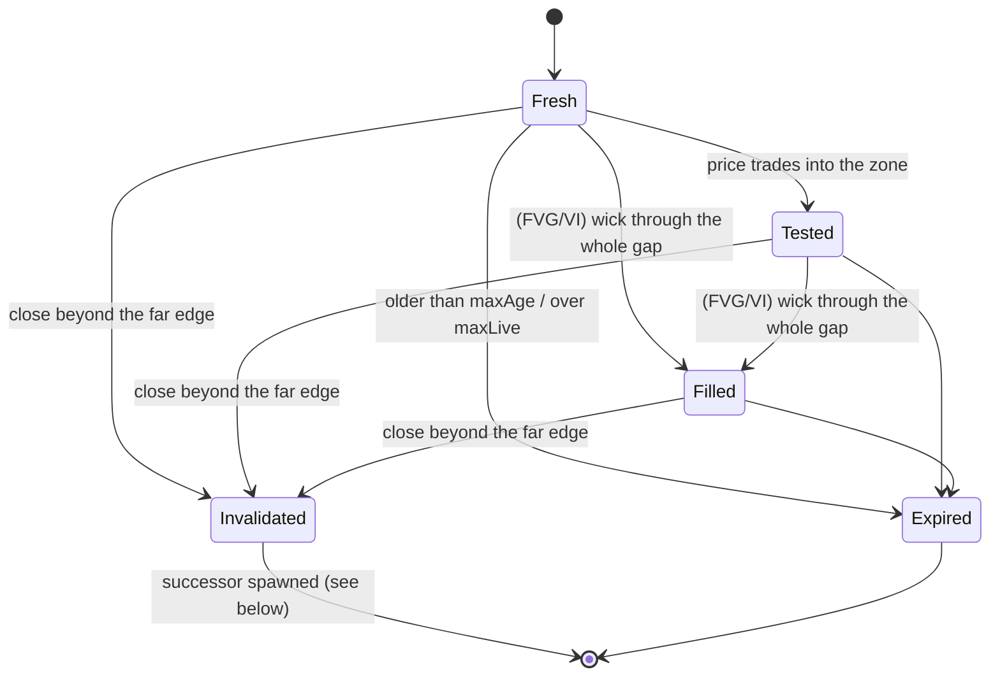
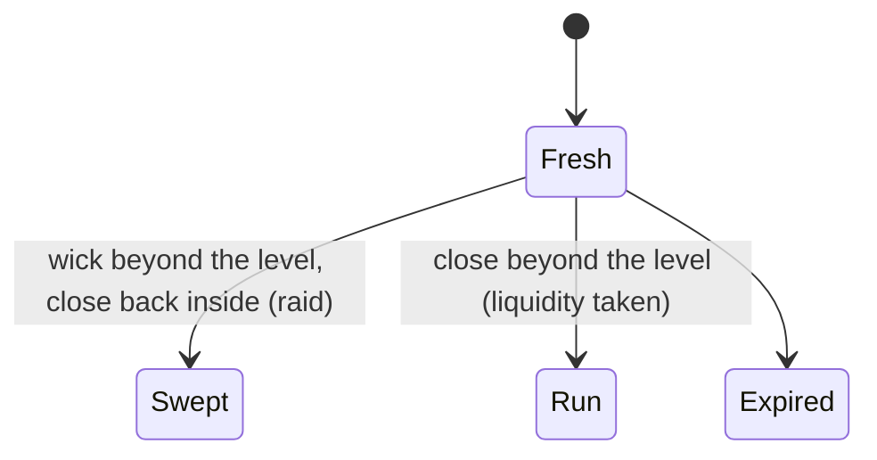

# ICT PD Array Matrix — Rulebook

This is the specification both implementations follow:

- `pine/PD_Array_Matrix.pine`: the TradingView indicator
- `pdmatrix/`: the Python reference engine, with the tests in `tests/` as executable examples

Each rule is tagged with its source. **[Slide n]** means it comes straight from the
"ICT's PD Array Matrix" thread (slides 1–11). **[Setup]** means the "One Setup for Life"
chart. **[Impl]** marks a decision the slides leave open. Those decisions are made the
same way in both implementations, and most of them can be changed in the settings.

---

## 1. Premium, discount, equilibrium  [Slide 3]

- PD arrays are algorithmic price reference points. Price is delivered from discount to
  premium or from premium to discount.
- **Equilibrium (EQ)** is fair value, the 50% level of a dealing range. Price above EQ is in **premium**, price below is in **discount**.
- PD arrays do **not** create direction. They line up with the higher-timeframe narrative and timing.

**Dealing range** [Impl]: each timeframe tracks trailing extremes. When a swing high is
confirmed, the range high resets to it. After that, any higher high extends the range
high. The low side works the same way. `EQ = (rangeHigh + rangeLow) / 2`.

## 2. The matrix  [Slide 4]

| Premium, from the range high down to EQ | Discount, from EQ down to the range low |
|---|---|
| 1. Liquidity Pool | 1. Mitigation Block |
| 2. Rejection Block | 2. Breaker Block |
| 3. Order Block | 3. Volume Imbalance |
| 4. Fair Value Gap | 4. Fair Value Gap |
| 5. Volume Imbalance | 5. Order Block |
| 6. Breaker Block | 6. Rejection Block |
| 7. Mitigation Block | 7. Liquidity Pool |

The table is symmetric. Liquidity pools sit at the extremes and mitigation blocks sit
closest to equilibrium.

**Membership** [Impl]:

- A premium cell holds a *bearish* array whose mean threshold is above that
  timeframe's EQ.
- A discount cell holds a *bullish* array whose mean threshold is below EQ.
- A bullish array in premium, or a bearish array in discount, is misaligned. It is
  still tracked and drawn, but it is left out of the matrix.
- When a cell has several candidates, it shows the one closest to the current price.
- Inversion FVGs share the FVG row and are marked `i`.

**Sequence**: when price delivers upward, it meets the live arrays above it in price
order. "Next ▲" and "Next ▼" in each column give the nearest live array entirely above
or below the current price. That array is the next draw on that timeframe.

## 3. PD array definitions

| Array | Source definition | Detection rule [Impl where not verbatim] | Zone |
|---|---|---|---|
| **Liquidity Pool** | [Slide 5] Stop orders cluster, usually above equal highs or below equal lows. The market seeks these areas. | Every confirmed swing high creates a buyside (BSL) pool, and every swing low creates a sellside (SSL) pool. A new swing within `eqTol × ATR` of a live pool merges into it (`touches++` = equal highs/lows). | A level: the swing high or low |
| **Rejection Block** | [Slide 6] Price tries to break a prior high/low, fails to hold, and reverses. | A confirmed swing whose rejection wick is at least `rbWickPct` of the candle's range. | Swing high: body top to wick high. Swing low: wick low to body bottom |
| **Order Block** | [Slide 7] The last bullish or bearish candle before an impulsive move that breaks structure or displaces price. | Triggered by a close through the last swing high/low (structure break), or by an FVG whose middle candle body is at least `dispAtr × ATR` (displacement). The OB is the last opposite-close candle within `obLookback` before the trigger. It is rejected if a later candle already closed through it. | Wick (full range) or body. The mean threshold is the 50% level of the body |
| **Fair Value Gap** | [Slide 8] A three-candle pattern that leaves an imbalance. Price often returns to rebalance it. | Bullish: `low[0] > high[2]`. Bearish: `high[0] < low[2]`. The gap must be at least `fvgMinAtr × ATR`. | The gap. CE is its 50% level |
| **Volume Imbalance** | [Slide 9] A gap between the bodies of two consecutive candles. Acts as a magnet. | `min(o,c)[0] > max(o,c)[1]` (bullish) or the mirror (bearish), with the wicks overlapping (optional). | The body gap |
| **Breaker Block** | [Slide 10] A candle or group of candles that acts as a point of order mitigation. | An order block that fails *after its leg ran liquidity*: the move from the OB went beyond the last swing high/low before the OB. Polarity flips. | The failed OB's zone |
| **Mitigation Block** | [Slide 11] A form of breaker that doesn't need a liquidity sweep. | An order block that fails *without* its leg running liquidity (a failure swing). Polarity flips. | The failed OB's zone |

Swings use a symmetric pivot of `swingLen` candles on each side. The left side must be
strictly lower (or higher) and the right side may be equal. ATR is a running mean for
the first `atrLen` candles and Wilder-smoothed after that.

## 4. Lifecycle, on every timeframe

Each PD array lives on the timeframe that created it. It moves through the lifecycle
only on **closed candles of that timeframe**, which gives the same result on history and
in real time. A 4H FVG can only be invalidated by a 4H close.

Liquidity pools have a shorter lifecycle:

**Successors.** A failed array flips polarity and starts again at `Fresh`, on the same
timeframe and over the same zone:

| Invalidated array | Successor |
|---|---|
| Fair Value Gap | **Inversion FVG (iFVG)** |
| Order Block, when its leg took liquidity | **Breaker Block** |
| Order Block, when its leg did not take liquidity | **Mitigation Block** |
| iFVG, Breaker, Mitigation, Rejection Block, Volume Imbalance | none (terminal) |

Other tracked facts:

- `taps`: the number of separate visits into the zone.
- `ce`: whether the mean threshold or CE was reached.
- `touches`: how many equal highs or lows a pool holds.
- `tookLiq`: for order blocks, whether the leg took liquidity. This decides Breaker
  versus Mitigation Block.

**Per-candle order** (identical in both implementations):

1. ATR update
2. Lifecycle step for every live array. Arrays created on this candle are not stepped.
3. Structure breaks against the last swing high and low
4. FVG and VI detection
5. Order block triggers
6. Dealing range update, then swing confirmation, which creates pools and rejection
   blocks. A new rejection block is retro-stepped over the `swingLen` candles that
   confirmed it.
7. Capacity: the oldest live arrays beyond `maxLive` expire

**Multi-timeframe** [Impl]: higher-timeframe candles are built from chart bars. When a
chart bar opens a new HTF period, the previous HTF candle is complete and gets
processed. The first HTF period is always discarded because it may be partial.
Timeframes at or below the chart timeframe are skipped. HTF depth is therefore limited
by how much chart history is loaded.

## 5. One Setup for Life  [Setup]

This is a bearish model. The bullish version mirrors it.

| Step | Chart annotation | Rule |
|---|---|---|
| 0 | *Premium PD array* | Price trades into a live **higher-timeframe** bearish PD array that sits in premium on its own timeframe. This arms shorts for `ctxWindow` bars. |
| 1 | *01 Liquidity Sweep* | While armed, an execution-TF buyside pool is **swept** (or run, when sweep mode is "Any"). The sweep extreme keeps extending until entry 1 is taken. |
| 2 | *02 First Entry: Inversion* | A bullish FVG is closed through and becomes a bearish **iFVG**. "IFVG: close below the low. Enter at the next candle's open." |
| 3 | *03 Second Entry: Breaker* | A bullish OB whose leg took liquidity fails into a bearish **Breaker**. "Breaker: close below the low. Enter at the next candle's open." |
| Stop | *Stop placement* | "At the high or above the inversion zone": either the sweep extreme or the far edge of the entry zone, plus an optional buffer. |
| Target | *Target Risk:Reward 1:2* | `entry ∓ 2 × risk` (configurable). |
| Timing | *Macro Execution Window* | The signal candle must overlap an ICT macro (New York time). AM: 07:50–08:10, 08:50–09:10, 09:50–10:10, 10:50–11:10, 11:50–12:10. PM: 13:20–13:40, 14:50–15:10, 15:15–15:45, 15:50–16:10. Bars of one day or longer always pass. |

Bookkeeping [Impl]:

- Each sweep leg allows one entry 1 and one entry 2, taken in that order. On a single
  candle, entry 1 is evaluated before entry 2.
- A leg expires `setupBars` after its sweep.
- A new sweep before entry 1 restarts the leg.
- The trade fills at the next candle's open. It is cancelled if that open is already
  beyond the stop.
- If the stop and the target print in the same candle, the stop is counted first
  (conservative).
